# Personalized Language Learning
UX Case Study | Iterative Research, Design, and Testing

## Background
This is an individual project I began working on as an Apprentice in User Experience at Fresh Tilled Soil, a Boston-based digital design agency. 

## Challenge
While gamified lesson plans are an effective and engaging way to learn for many, I wanted to explore alternatives to this format where material is learned more organically, is more freely and meaningfully associated, and is unique to every learner. 

I chose to design an experience for learning American Sign Language, other than my personal interest in learning it, because I was intrigued by the potential challenges it poses and opportunities it may afford compared to a hands-free, oral language. With American Sign Language is also a rich culture to immerse yourself in and diverse communities of hearing, hard of hearing, and deaf individuals to connect with.

## Approach
I approached this project through iterative design sprints consisting of five phases:
 
* *Understanding* user needs and motivations
* *Diverging* to generate many ideas
* *Converging* on one idea
* *Prototyping* that core user flow
* *Testing* my most dangerous assumptions

---

## Sprint 1

### Understand
During the initial sprint, I wanted to better understand people’s motivations behind learning another language and explore what patterns of studying behaviors existed. Through interviews, I discovered that people were studying in shorter, more frequent sessions, on the go, and often times spontaneously rather than following a structured study schedule. 
### Diverge
I began sketching ideas for short, engaging learning exercises and ways to capture moment-of-learning associations, such as what the user was doing, where she was, or how she was feeling during those exercises. Referred to as “hints”, these associations would always remain attached to the words, serving as memory aids when needed.

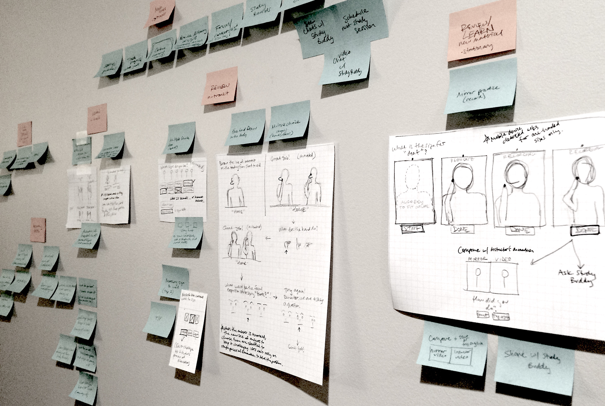

### Converge
The core user flow began with learning the sign for a word, then adding a hint, and finally seeing that hint available during review exercises. 

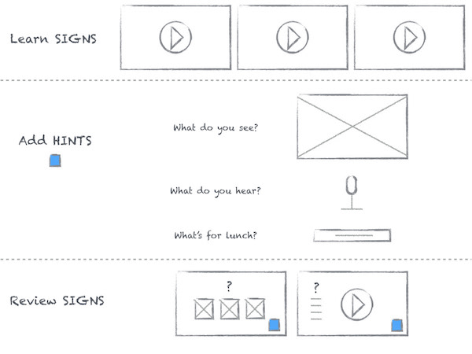

### Prototype
Starting with paper prototypes, I moved to Keynote so that I could include videos of words being signed. Keeping this prototype at low-fidelity allowed me to test my assumptions and get the most valuable feedback regarding core user flow rather than UI design.

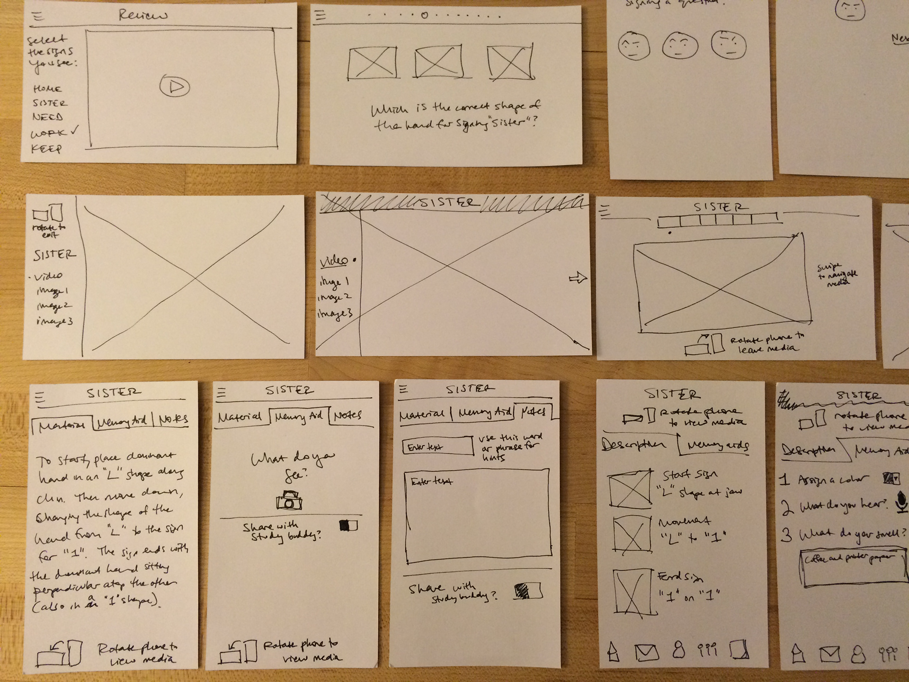 

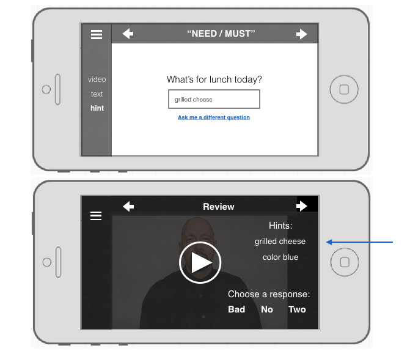

### Test
#### Method
The most dangerous assumption I wanted to test here was that users would find it engaging and useful to associate each new sign they learned with something specific about the moment they learned it. 

I recruited five participants with no prior experience learning American Sign Language. Simply because of time constraints, this test was conducted remotely using Keynote and video/voice chat. 

Participants were asked to think aloud while they used the prototype to learn new signs and complete review exercises. Because I was moderating, observing, listening for what participants were and weren’t saying, and taking notes, each session was also recorded with the participant’s consent.
#### Findings
Overall, participants were confused by the idea of explicitly choosing an association to make with certain signs. Referring to them as "hints" and "memory aids" increased confusion, as participants expected that the hint would directly relate to the actual meaning of the sign rather than relate back to the moment they learned the sign. Every participant wanted more flexibility with creating hints, mainly the ability to take notes and draw. 
#### Further insight
Attempting to measure how well people were remembering signs they had learned using hints with just a handful of participants wasn't too effective. Particularly because of the confusion around what the hints were and how they were being used, it was much more valuable to simply hear their thoughts and observe their behaviors while testing the prototype. 

In addition, this particular usability test would have been much more effective if it were conducted as a field study, which would allow participants to use real rather than simulated moment-of-learning experiences as associations. 

---

## Sprint 2
From the feedback, observations, and lessons learned in the first sprint, it only made sense to use this next sprint to test my next set of assumptions out in the real world, testing how people learn new signs and create hints at different times of day and in different types of environments.
### Understand
I first wanted to better understand how people use spare time throughout a typical day. Through in-depth interviews, I recorded detailed accounts of each individual's experience throughout a specific day, including what they were feeling and thinking.   

I found that individuals used their lunch and commute time primarily to connect with close friends and family, sharing with others where they were, what they were doing, and how they were feeling. 

### Diverge
What if these moments of sharing with others were also used for learning new signs? 

What if the user is in control of the material she learns based on what she is doing, where she is, and how she is feeling? 

In learning signs relevant to what is going on in the user's life at that moment, the user no longer needs to rely on adding hints for creating moment-of-learning associations.

### Converge
Instead of learning a pre-determined series of signs, the revised key user flow then begins with learning signs that are relevant to the user during that moment-of-learning. 

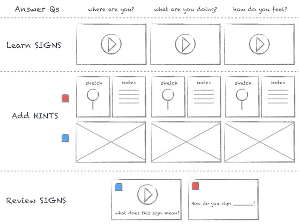

This was done by prompting the user to answer questions like "Where are you?", "What are you doing?", or "How do you feel?". 

Adding hints becomes a practical way to help learn new signs in whatever format is most effective - notes, a sketch, image, or other media. 

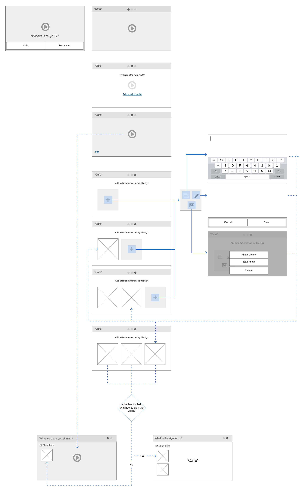

### Prototype
From this wireflow, I created interactive prototypes with video layers using Flinto. Because I was still testing core user flow, I kept the fidelity level low. During usability testing, I gave participants paper prototypes for actually creating their hints. 

### Test
#### Method
The key assumptions I wanted to test were:

- Users will add hints for helping them remember the meaning of the sign. 

- Users are more likely to create hints and capture their environment if the environment is interesting and at a more productive time of day (ie, morning or afternoon rather than at the end of the work day).
 
- Users will rely mostly on notes and sketches for remembering what signs mean when they are using the app during their commute, rather than take photos. 

To do this, I observed four participants learning signs and creating hints while in different environments and times of day. The tests with participants A and B were divided into separate sessions on different days. 

 Participant | Morning Commute | Afternoon Coffee/Lunch | Evening Commute 
:-------------:|:---------------:|:-------------:|:---------------:
 A || X | X
 B | X | X ||
 C || X | 
 D || X | 

For this usability testing, I teamed up with other apprentices for help with recording sessions and taking notes. 

#### Findings
##### User-generated hints

Rather than add hints for helping them remember the meaning of the sign, most participants added hints for remembering *how* to sign the word they were learning. 

Participants A, B and C created hints for remembering how to sign words. Participants A and B chose to describe hand shape and movement by drawing diagrams and adding notes. Participant C added detailed descriptions to describe hand shape and movement, in addition to drawing diagrams. 

Only Participant D created hints for remembering what signs meant, using drawings and notes.

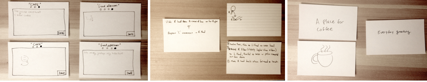

Overall, participants seemed to prefer adding notes as their primary hint, regardless of how the hint was to be used and under what environmental conditions the moment-of-learning was.  

##### Reviewing signs with user-generated and app-generated hints
In the second sessions with participants A and B, hints they created for signs they learned in the previous session were used to help them remember how to sign the word. When asked to recall the meaning of signs, they could see other words they learned at the same time and when or where they learned that group of signs.

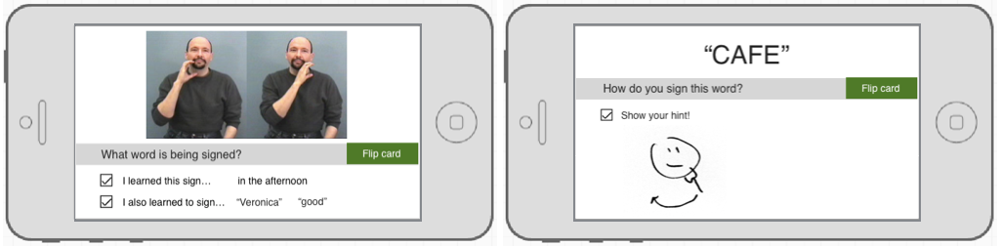

Incorporating user-generated and app-generated hints in this way was easy for both participants to understand and use. Both participants were willing, but less excited, to take a photo of themselves signing or of their surroundings during their morning and evening commutes. Not surprisingly, both were more interested in taking photos while having lunch. ​​​​​​​

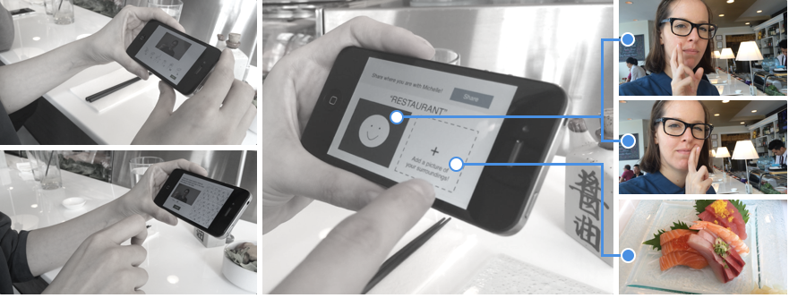

#### Further insight
All but one participant were willing to take photos of themselves or their surroundings, particularly in the afternoon at lunchtime. All but one participant developed strategies for taking photos/videos of themselves signing a two-handed sign. In other words, people were able to find a way to accomplish something if they were motivated enough to do so. However, having to prop your phone up against a cup of coffee at the table, or placing your phone temporarily on your lap while on a moving train isn't the best experience.

Other interesting findings were:

- Participants expressed that they felt comfortable learning to sign in busy public environments because no sound was necessary.
- Participants got left and right confused, some had much more trouble with this than others.
- Participants had trouble initially learning a sign when presented by more than one person.
- Participants enjoyed learning their names and seeing their names used throughout the prototype.

## Sprint 3

The focus of the final sprint was to build on the exploratory findings of the previous sprints, redefining the core user flow to create a personalized language learning experience for real users.

### Understand

I began research into who is practicing sign language, what their motivation is to learn/practice American Sign Language, and what their level of proficiency is. 

From this research, three key personas and an important user story that connects them emerged: 

1. 'Just Learning' Jill (hearing with a deaf friend or relative, and primarily beginner ASL level)
2. 'Busy Cousin' Ben (deaf, fluent in ASL, interested in making friends, encouraging and supporting anyone interested in strengthening their ASL skills or getting involved in the deaf community, and interested in creating a stronger, more diverse deaf culture)
3. 'Keeps Practicing' Kate: ()

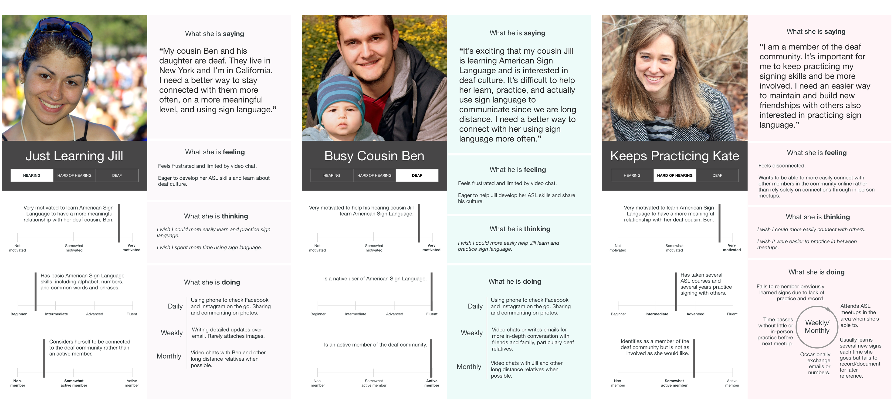

#### Ben and Jill

Ben is deaf and fluent in ASL. He enjoys making new friends, encourages anyone interested in strengthening their ASL skills, and is actively involved in the deaf community.

Ben frequently shares photos on Facebook and Instagram. His cousin Jill, in California, often comments on his social media posts in an effort to stay connected. Every so often, Ben and Jill will find time to video chat. 

Jill is hearing and just beginning to learn American Sign Language in order to connect with Ben and the family more. She is very motivated to learn sign language in order to build a stronger relationship with her cousin. 

While video chat enables Jill to learn and practice new signs with Ben as they would in person, she and Ben struggle to have meaningful conversation over what turns into a half hour tutoring session. Infrequent video chatting adds to the struggle, since Jill goes weeks without practice signing with another person. 

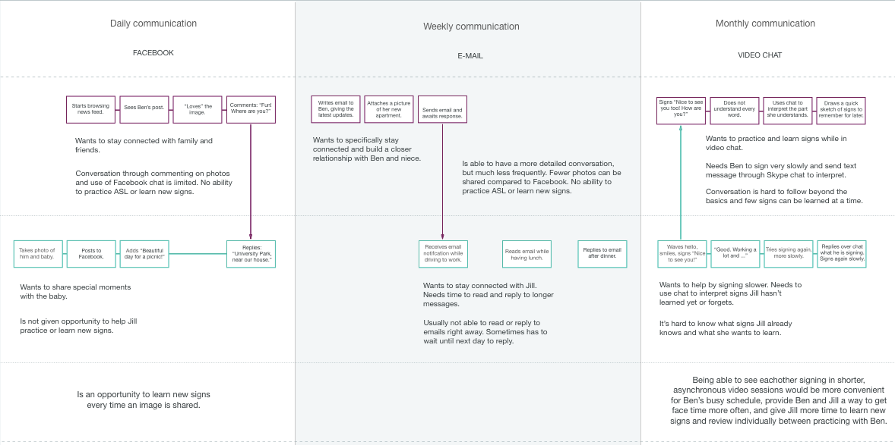

In mapping the experience of daily, weekly, and monthly interactions between Ben and Jill, I was able to pinpoint opportunities for addressing specific pain points.

Ben and Jill frequently connect through sharing photos. Each time either shares a photo could be an opportunity for Jill to learn new signs and share what she is learning with Ben. With access to media created by users fluent in American Sign Language, Jill could describe the photo she is sharing with Ben using sign language. Having attached various signs to the description of her photo, she is able to review all of the signs she has learned, add notes and/or sketches, and more easily share what she is learning with others.

#### Kate

Kate is hard of hearing. On a weekly or monthly basis she meets with others to practice ASL and stay connected with the deaf community. Due to limited signing practice, however, she often finds it difficult to establish more meaningful relationships. She needs a way to more easily and more frequently connect with others in the community.

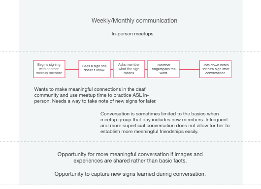

In mapping Kate's specific flow of interactions when practicing sign language in person, the key opportunities discovered were:

- Kate could have more meaningful conversations if photos were shared.
- She could more effectively learn new signs while in conversation if she could better capture them to practice later.

### Diverge
All the different ways the core user flow could be prototyped.

### Converge

A new core user flow

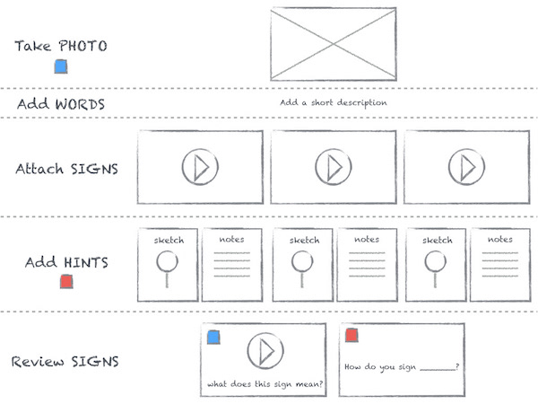

Beyond just the idea for the core user flow, now the experience designed from that core user flow.
In addition, on-boarding experience.

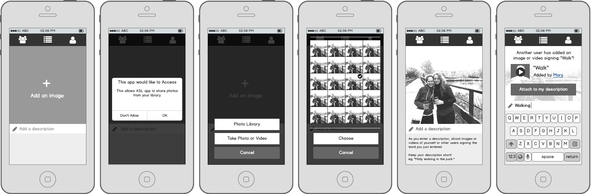

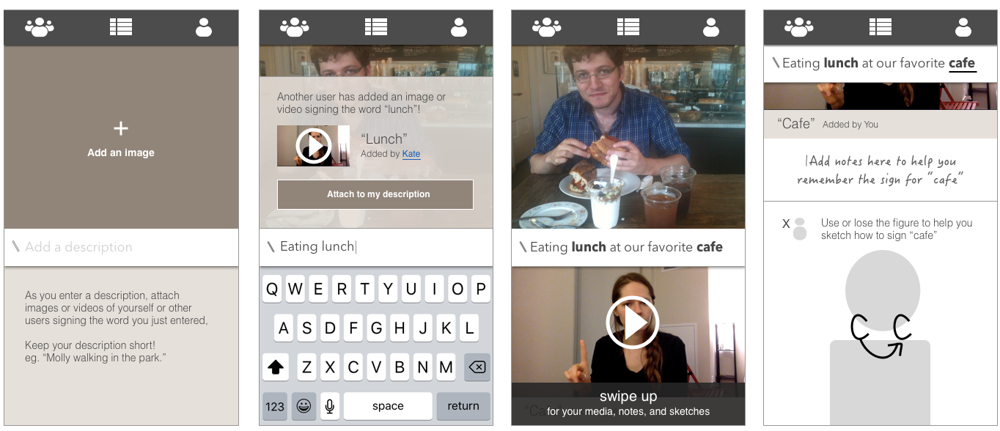

### Prototype
Higher fidelity.

### Test?
Plans for if tests happen...they will be tested on people who actually fit one of the personas maybe, and will be more for improving the design of the UX/UI, moving beyond testing core user flow. 

## Reflections on the Process

## Personalizing any language learning experience

### Extracting a template
[ empty prototype ]

Most Important User Story - paragraph story involving *personas with empathy maps*, details from *experience map*.

Most important User Story
What is is and how it was developed from the personas, each persona’s empathy map, and experience mapping the major pain points, motivations, and opportunities.

