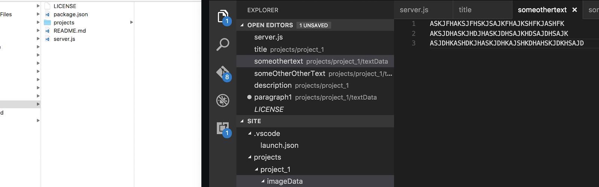
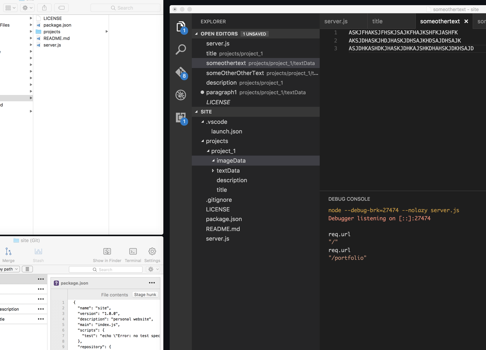

# Project 1

This is the description of project 1 from markdown.

## Section 1

### Subtitle 1

During the initial sprint, I wanted to better **understand** people’s motivations behind learning another language and explore what patterns of studying behaviors existed. Through interviews, I discovered that people were studying in shorter, more frequent sessions, on the go, and often times spontaneously rather than following a structured study schedule.

### Subtitle 2

During the initial sprint, I wanted to better understand people’s motivations behind learning another language and explore what patterns of studying behaviors existed. Through interviews, I discovered that people were studying in shorter, more frequent sessions, on the go, and often times spontaneously rather than following a structured study schedule.

### Subtitle 3

During the initial sprint, I wanted to better understand people’s motivations behind learning another language and explore what patterns of studying behaviors existed. Through interviews, I discovered that people were studying in shorter, more frequent sessions, on the go, and often times spontaneously rather than following a structured study schedule.

